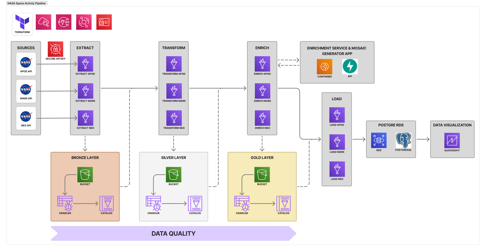

# 🚀 NASA ETL Pipeline with AWS Glue & Lightsail

## 🌌 Overview

This project implements a robust, cloud-native ETL pipeline that extracts data from three NASA APIs:

- 🪐 **Astronomy Picture of the Day (APOD)**
- ☄️ **Near Earth Object Web Service (NeoWs)**
- 🚜 **Mars Rover Photos**

The pipeline is orchestrated on **AWS Glue** and enriched through a microservice hosted on **AWS Lightsail**, which
performs tasks like image metadata extraction, classification (**PyTorch**) and asteroid threat score. Infrastructure is
provisioned using **Terraform**, and the final datasets
are stored in an **AWS RDS PostgreSQL** instance.
****
It follows the **Medallion Architecture**:

- **Bronze**: Raw API data (Extract)
- **Silver**: Cleaned and normalized data (Transform)
- **Gold**: Enriched, query-ready data (Enrich)

<p align="center">
  
</p>

> ETL Architecture diagram.


The pipeline is modular, extensible, and designed with traceability, reliability, and automation in mind. It includes
workflow orchestration with job dependencies and retry logic for failure resilience.

> ⚠️ Most services run on the AWS Free Tier, but a few (e.g., Lightsail) might incur small costs. Don’t forget to tear
> down the infra with `terraform destroy` when done.

## 📊 QuickSight Dashboard

The final enriched datasets stored in PostgreSQL can be easily visualized using Amazon QuickSight. This dashboard
showcases metrics like asteroid threat levels, Mars rover activity by date and camera, and APOD image trends — all
presented in an interactive and visually appealing format.

<p align="center">  </p>

> Example of the QuickSight Dashboard built on top of the gold-layer data.

## Bonus

As a bonus I created a simple
[**web application**](https://enrichment-service.sfdw802c78hbe.ap-northeast-1.cs.amazonlightsail.com/static/index.html)
that allows users to generate mosaics from the space images.

<p align="center">
  
</p>

> Example of image generated with the Mosaic Generator app.

---

## 🧰 Prerequisites

- [Terraform](https://www.terraform.io/downloads.html)
- [AWS CLI](https://aws.amazon.com/cli/)
- [Lightsail Control plugin](https://docs.aws.amazon.com/lightsail/latest/userguide/amazon-lightsail-install-software.html#install-software-lightsailctl)
- [Docker](https://www.docker.com/)

---

## ⚙️ Getting Started

### 1. Provisioning AWS Infrastructure

1. Add your secrets to `infra/secrets.auto.tfvars`. See `infra/secrets.auto.tfvars.example` for guidance.

```hcl
nasa_api_key               = "YOUR-KEY-HERE"
enrichment_service_api_key = "YOUR-KEY-HERE"
aws_access_key_id          = "YOUR-KEY-HERE"
aws_secret_access_key      = "YOUR-KEY-HERE"
db_password                = "YOUR-RDS-PASSWORD-HERE"
alert_email                = "YOUR-ALERT-EMAIL-HERE"
```

2. Deploy the infrastructure:

```bash
cd infra
terraform init
terraform apply
```

---

### 2. Deploying the Enrichment Microservice

After provisioning, deploy the containerized microservice on AWS Lightsail:

1. Create the environment file `.env` and config file `lc.json` in `enrichment-service/`. Use the `.example` templates
   provided.

`.env`

```env
API_KEY=YOUR-KEY-HERE
DB_NAME=nasa
DB_USER=postgres
DB_PASSWORD=YOUR-RDS-DB-PASSWORD
DB_HOST=YOUR-RDS-DB-HOST
DB_PORT=5432
```

2. Build and deploy using:

```bash
enrichment-service/build-and-deploy.bat
```

---

### 3. Preparing the Database

1. Once the infrastructure and enrichment service are up and running, you’ll need to initialize the PostgreSQL database
   with the necessary schemas, views, and materialized views. To do that, simply run the setup script:

To do that, simply run the setup script:

```bash
python etl/db/create_tables.py
```

This script will:

- Create structured tables for APOD, NeoWs, and Mars Rover datasets
- Define helper views for unified queries
- Register materialized views to optimize performance for dashboarding

> Make sure your .env file in enrichment-service/ is correctly set up with your RDS credentials before running the
> script.

## 📊 Features

- Automated Extraction & Loading using AWS Glue workflows and triggers
- Data Transformation with PySpark (flattening, normalization, deduplication)
- Image Metadata Extraction and Classification via FastAPI microservice + PyTorch (Lightsail)
- PostgreSQL-Compatible Schemas for APOD, NEO, and Mars Rover datasets
- Job Monitoring via CloudWatch Logs and optional SNS notifications
- IaC using Terraform with modular structure for scalability

---

## 🗂️ Project Structure

```bash
.
├── infra/                      # Terraform code (S3, RDS, Glue, IAM, etc.)
├── enrichment-service/         # FastAPI microservice for image metadata enrichment and Mosaic Generator app
├── etl/
│   ├── extract/                # Raw data extraction logic
│   ├── transform/              # Data cleaning & normalization
│   ├── enrich/                 # Data enrichment through lightsail service
│   ├── db/                     # Database definition for PostgreSQL
│   └── load/                   # Load to RDS via JDBC
├── docs/                       # Diagrams and reports
└── README.md
```

## 📝 Report

- [Challenge Report](docs/REPORT.md)